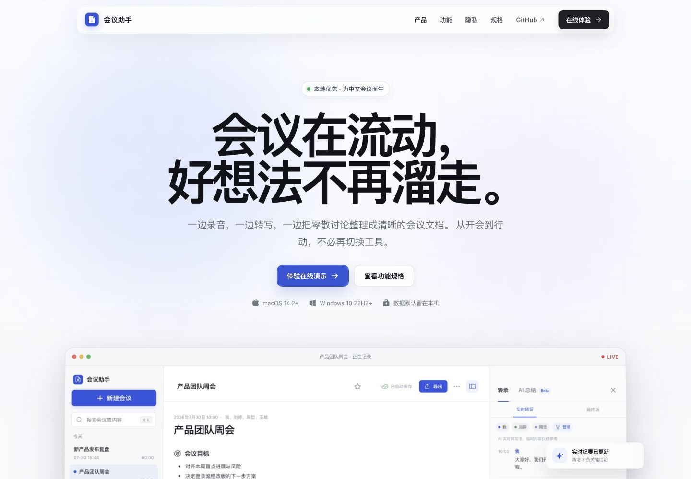
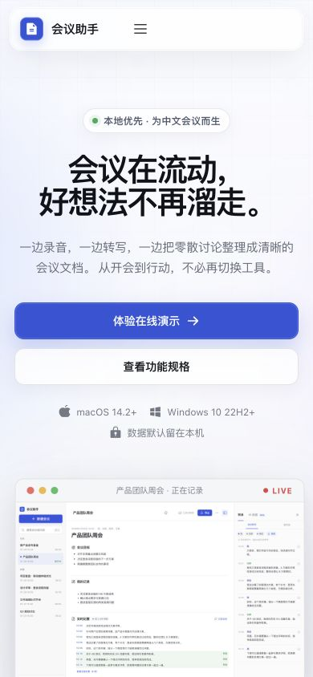
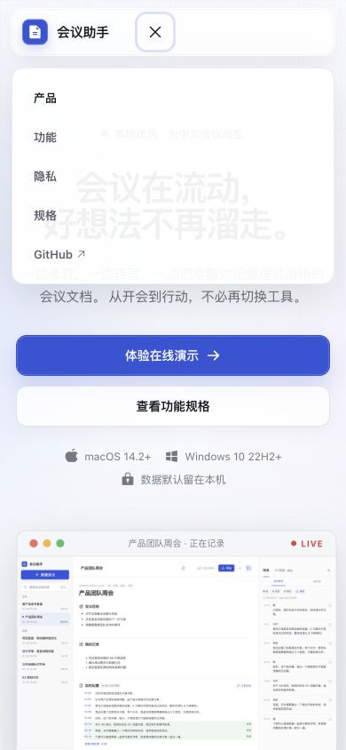
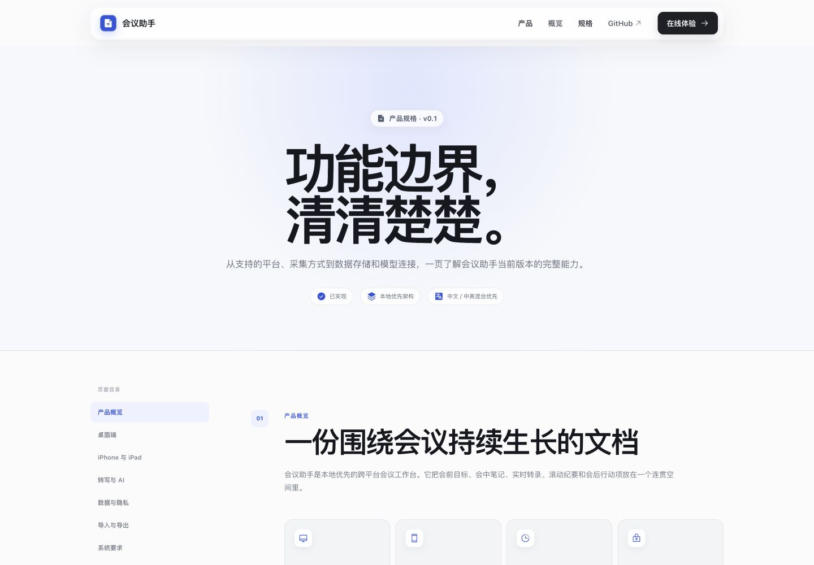

# 会议助手产品站样式与动效自查

## 审查范围

- 桌面端产品首页
- 桌面端功能规格页
- 移动端产品首页与导航菜单
- 首页锚点导航与“记录 / 整理 / 行动”切换
- reduced-motion / reduced-transparency 代码路径

## 发现与修复

1. 深色按钮文字不可读
   - 原因：通用链接颜色选择器覆盖了按钮的白色文字。
   - 修复：提高深色与主按钮颜色规则的明确性。

2. “功能 / 隐私”导航回弹到页面顶部
   - 原因：所有 hash 变化都触发了路由级回顶。
   - 修复：仅在首页与规格页真正切换时回顶；页内导航改为可减少动态的平滑滚动。

3. 移动端首屏标题出现孤行
   - 原因：390px 宽度下标题字号过大，“走。”被单独挤到第三行。
   - 修复：移动端采用更克制的字号、行高和字距。

4. 功能切换动效有额外绘制成本
   - 原因：内容出现时同时动画 `filter: blur()`。
   - 修复：保留位移与透明度，移除模糊动画；音频波形只动画 `transform`。

5. 移动端触控目标偏小
   - 修复：菜单按钮、菜单项与移动规格目录统一提高到至少 44px。

6. 首屏出现短暂加载空白
   - 原因：营销页也被延迟加载。
   - 修复：产品站主体改为同步加载，仅在线演示应用继续按需加载。

## 修复后证据

## 验证边界

截图可以确认布局、层级、断行和可见状态；键盘顺序、屏幕阅读器朗读和真实低性能设备上的帧稳定性仍需要专项测试，不能仅凭截图声明完整无障碍合规。
