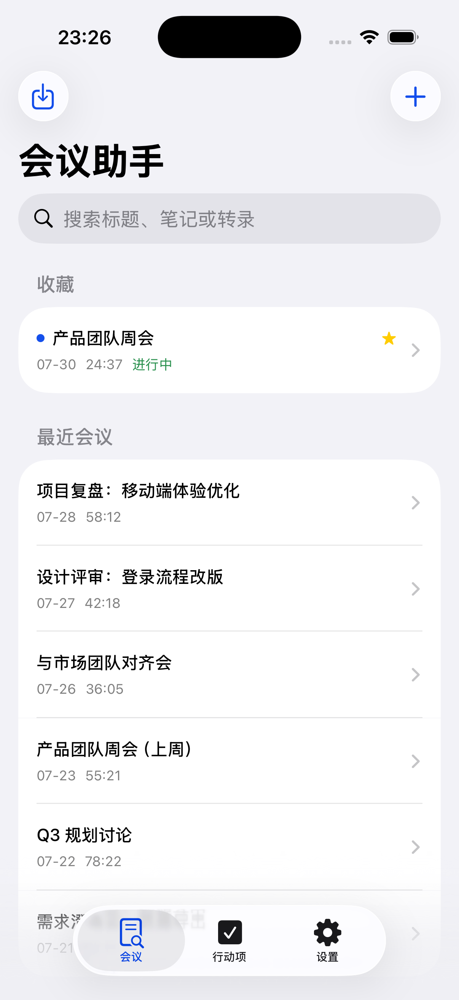
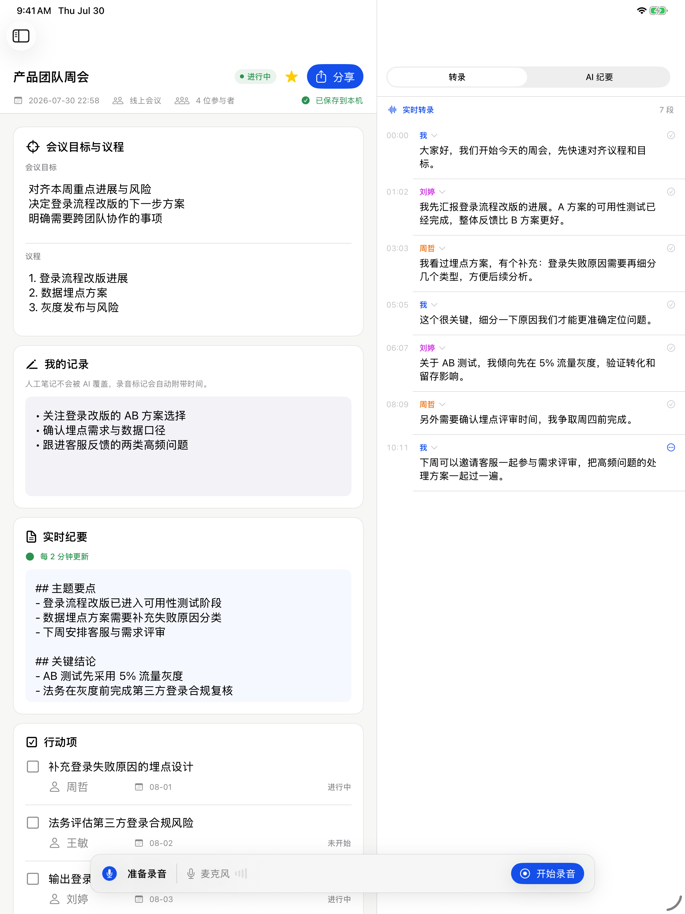

# 会议助手 iOS

SwiftUI 编写的 iPhone 与 iPad 通用版本，目标系统为 iOS/iPadOS 18 及以上。

## 主要能力

- SwiftData 本地会议库、全文范围搜索、收藏、软删除与恢复
- 可编辑会议目标、议程、人工笔记、实时纪要、决策、问题、风险与行动项
- 麦克风录音、暂停/继续、音量反馈、时间戳标记和 Apple Speech 实时转录
- 默认两分钟增量纪要，停止录音后执行最终整理
- OpenAI 兼容纪要模型和远程 Whisper 导入配置，API Key 保存到 Keychain
- 音频/视频文件导入与 Apple Speech 或远程 Whisper 转录
- Markdown、TXT、SRT 与 JSON 备份导出
- iPad 多栏工作区与 iPhone 标签页/导航栈自适应布局

## 工程

工程由 XcodeGen 生成，已提交可直接打开的 `MeetingAssistant.xcodeproj`。

```bash
xcodegen generate
xcodebuild test \
  -project MeetingAssistant.xcodeproj \
  -scheme MeetingAssistant \
  -destination 'platform=iOS Simulator,name=iPhone 17 Pro'
```

## 平台限制

- iOS 版本录制麦克风输入，不捕获其他 App 的受保护系统音频。
- Apple Speech 是否完全在设备端运行取决于语言、设备和系统资源。
- 当前说话人标签支持手动改名与重新分配，不建立跨会议声纹或推断真实身份。
- 提交 App Store 前仍需发布方配置开发团队、真机权限测试和 TestFlight 验证。

## 验证截图

| iPhone | iPad |
| --- | --- |
|  |  |
